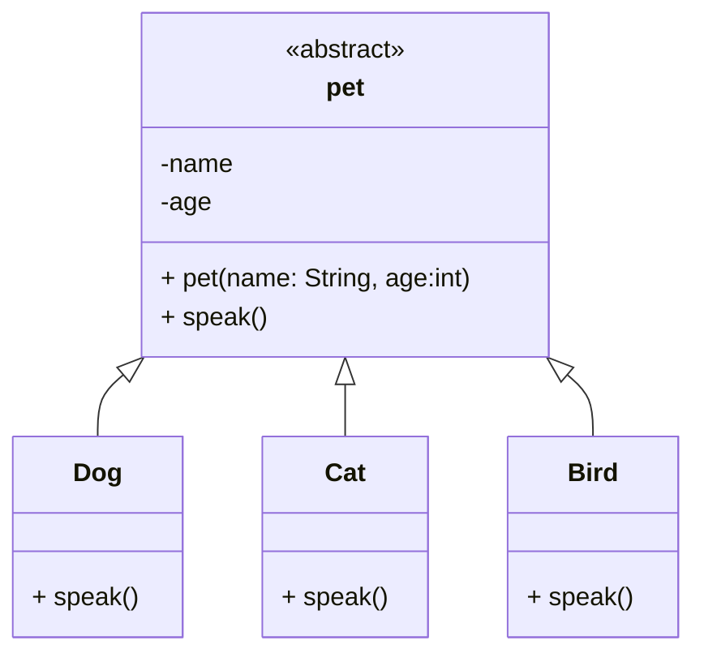

```mermaid
classDiagram
    class pet{
    <<abstract>>
    -name
    -age
    + pet(name: String, age:int)
    + speak()
    }
    class Dog{
    + speak()
    }
    class Cat{
    + speak()
    }
    class Bird{
    + speak()
    }
    pet <|--Dog
    pet <|--Cat
    pet <|--Bird
``` 